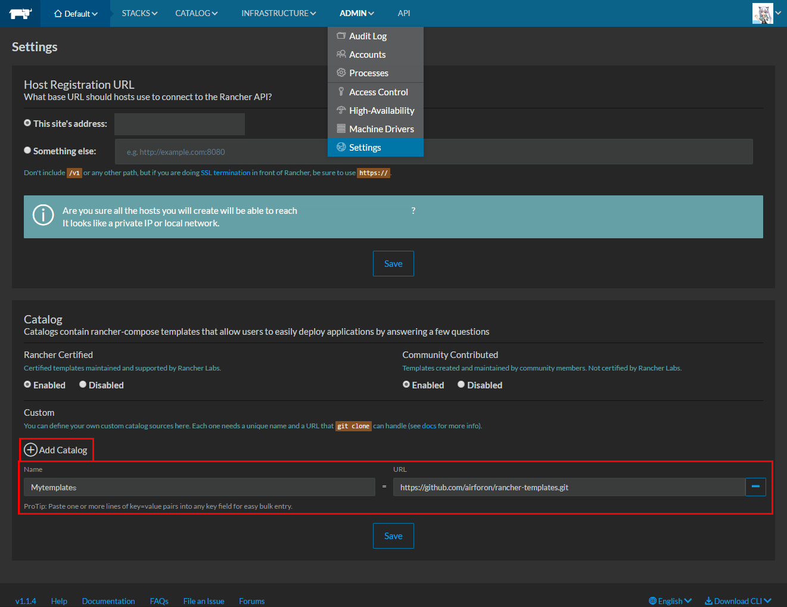
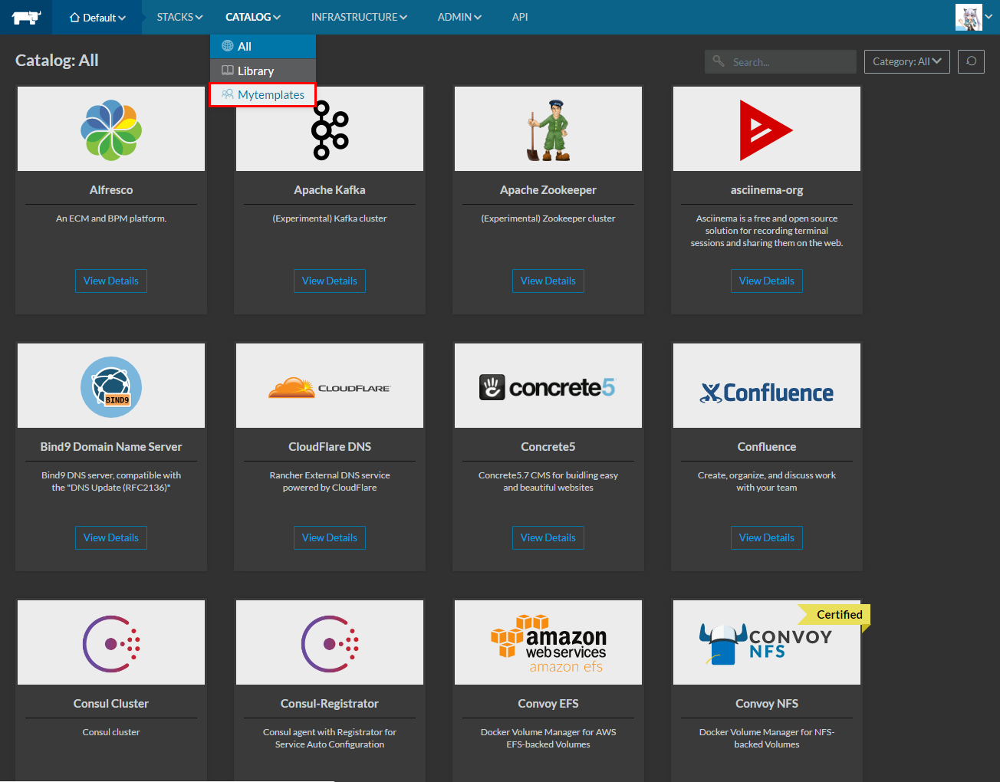

# rancher-templates
## HOW TO.
### Add catalogIcon

+ Click `ADMIN` → `Settings`
+ Click `Add Catalog`

| Name | variables |
|:-|:-|
| Name | Mytemplates |
| URL | [https://github.com/airforon/rancher-templates.git](https://github.com/airforon/rancher-templates.git) |

### Catalog Use

## owncloud test ver

+ Version
  + latest
  + 9.1.1
  + 9.1.1-fpm
  + 9.0.5
  + 9.0.5-fpm
  + 8.2.8
  + 8.2.8-fpm
  + 8.1.10
  + 8.1.10-fpm
  + 8.0.15
  + 8.0.15-fpm
